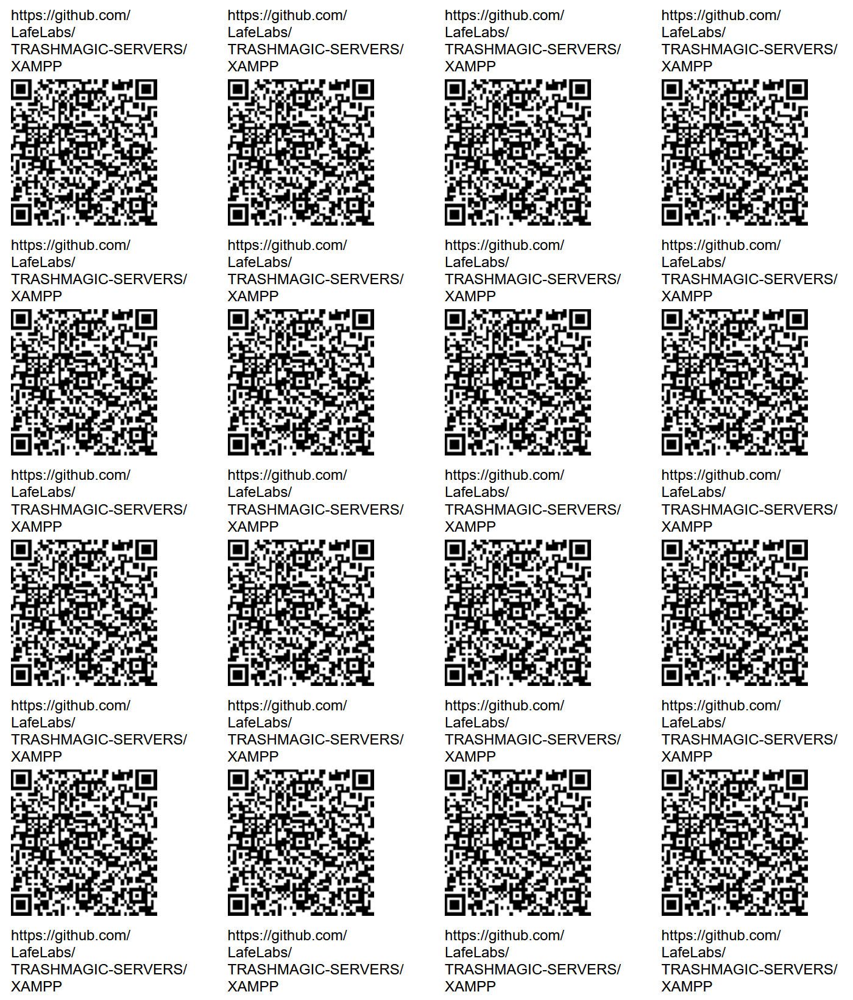

# XAMPP SERVER

XAMPP IS A FREE WEB SERVER APP THAT CAN RUN FROM ANY COMPUTER, ON ALL THREE MAJOR OPERATING SYSTEMS!

IT WORKS ON WINDOWS, MAC, AND LINUX!

YOU CAN DOWNLOAD IT AT [https://www.apachefriends.org/](https://www.apachefriends.org/)!

DOWNLOAD AND INSTALL!

THEN YOU CAN PUT ALL THE FILES FOR YOUR WEB PAGES AND WEB CONTENT IN THE FOLDER C:\xampp\htdocs !

COPY ALL THE CONTENTS OF SOME EXISTING SERVER INTO THE NEW SERVER, THEN EDIT IT ON LOCALHOST WHEN THE SERVER IS RUNNING!

FIND A LOCAL WEB DEVELOPER, AND ALSO  LEARN A LITTLE HTML!

ONCE THE SERVER IS LIVE, TAKE IT TO A SHARED WIFI NETWORK AND PUT IT ON THE NETWORK, FIND YOUR IP ADDRESS VIA THE WIFI SETTINGS ON THE SERVER COMPUTER!

THEN POINT THE QR CODES AND LINKS TO 

http://[put your IP address here]

BEING SURE TO USE "HTTP" WITHOUT THE S, NOT "HTTPS"

POINT GLOBAL TRASH MAGIC WEB PAGES OR OTHER LOCAL SERVERS TO THE NEW SERVER ON THE LOCAL NETWORK!

ASK FOR CONTENT FROM COMMUNITY AND PUBLISH IT AND SHARE IT!

BUILD A FREE NETWORK!

 - [readmeeditor.html](readmeeditor.html)
 - [qrcode.html](qrcode.html)
 - [learn HTML at W3schools](https://www.w3schools.com/html/)
 - [BACK UP TO MAIN SERVER PAGE](../)

